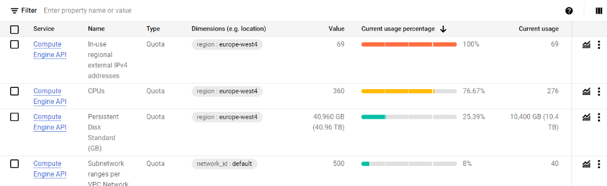
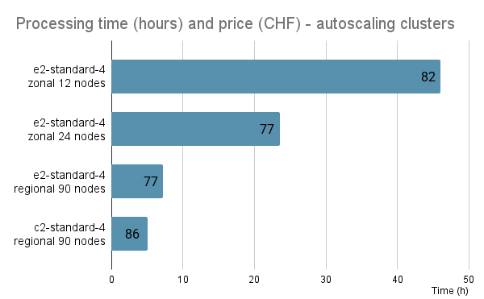
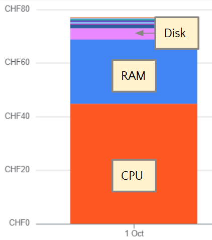

:::::::::::::::::::::::::::::::::::::: questions 

- How to process a full dataset?
- What is an optimal cluster setup?
- What is an optimal job configuration?

::::::::::::::::::::::::::::::::::::::::::::::::

::::::::::::::::::::::::::::::::::::: objectives

- Optimize the cluster setup for a full dataset processing.
- Learn about job configuration.

::::::::::::::::::::::::::::::::::::::::::::::::


## Resource needs


### Create a small cluster and connect

If you do not have the cluster from the previous sections, create a new one. Set the number of nodes `gke_num_nodes` to 2 in the `terraform.tfvars` file and create the resources, run

```bash
terraform apply
```

and confirm "yes".

Connect to it with

```bash
gcloud container clusters get-credentials <CLUSTER_NAME> --region europe-west4-a --project <PROJECT_ID>
```

### Run a test job

Run a small test as in the previous section, but set the number of parallel jobs to one. The corresponding input parameter in `argo/argo_bucket_run.yaml  ` is

```
- name: nJobs
      # Number of jobs the processing workflow should be split into
      value: 1
```

Submit the workflow with

```bash
argo submit -n argo argo/argo_bucket_run.yaml
```

While the job is running, observe the resources usage with

```bash
kubectl top pods -n argo
```

The big processing step - with `runpfnano` in the name - defines the resource needs. The output indicates how much CPU (in units of 1/1000 of a CPU) and memory the process consumes. Follow the resource consumption during the job to see how it evolves.

The job configuration, i.e. how many jobs will be submitted in a node, is defined by the resouce requests in the workflow definition.

In this example, we have defined them as

```
      resources:
        requests:
          cpu: "780m"
          memory: "1.8Gi"
          ephemeral-storage: "5Gi"  
```

and the main constraint here is the CPU. This request will guarantee that only 1 jobs will run on a CPU.

### Delete the cluster

Once you have understood the resource consumption for a single job, delete the cluster with `terraform destroy`.


## Cluster configuration

### Input data

The optimal cluster configuration depends on the input dataset.
Datasets consist of files, and the number of files can vary. Files consist of events, and the number of events can vary. 

In practical terms, the input to the parallel processing steps is a list of files to be processed. We do not consider directing events from one file to different processing steps. It could be done, but would require a filtering list as an input to the processing.  

In an ideal case, the parallel steps should take the same amount of time to complete. That would guarantee that the resources are used efficiently so that no idle nodes - for which we still pay for - remain while the longer jobs still continue. However, this is usually not the case because

- input files are not equal in size
- processing time per events can vary.

However, the best approach is to have the same amount of files in each parallel step. Eventually, the files could be sorted according to their size and their share to the nodes could be optimized.

In the example case, we have used the [MuonEG MiniAOD dataset](https://opendata.cern.ch/record/30511) with 353 input files.
For that number of files, we deployed a cluster with 90 nodes 4-vCPU nodes, providing a total of 360 vCPUs. We can therefore define a workflow with 353 parallel jobs and have a close to full occupation of the cluster.

The relevant Terraform input variables fur such cluster are

```
project_id          = "<PROJECT_ID>"
region              = "europe-west4"
gke_num_nodes       = 30
```

Note that as the "zone" (a, b or c in the location name, e.g. europe-west4-a) is not defined, the cluster will have 30 nodes in each zone, in total 90.

Alternatively, a smaller cluster would be less expensive per unit time but the processing takes a longer. In the benchmarking, a large cluster was found to be practical.


:::::::::::::::::::::::::::::::::::::::::: spoiler

### Insufficient quota?

GCP sets quotas to resources, and you can either increase them - to a certain limit - or request a quota increase.

You will notice when you go beyond the predefined quota from this type of message during the cluster creation:

```
[...]
Error: error creating NodePool: googleapi: Error 403: 
Error waiting for creating GKE cluster: Insufficient quota to satisfy the request:
```

If that happens, go to the [Quotas & System Limits page](https://console.cloud.google.com/iam-admin/quotas) at the Google Cloud Console. The link is also in the error message. Search for quotas that you need to increase. 

For a cluster with a big number of nodes, you must increase the quotas for "CPUs" and "In-use regional external IPv4 addresses". You might see something like this:



(In this case, the number of CPUs was increased, but the cluster creation failes because "In-use regional external IPv4 addresses" was too low.)

Once you find the quota line, click on the three vertical dots and choose "Edit quota".

If you can't increase them to desired value, submit a quota increase request through the form as explained in the [Google Cloud quota documentation](https://cloud.google.com/docs/quotas/view-manage#requesting_higher_quota). You will receive an email with increase request approved (or rarely denied if the location is down in resources). It is usually immediate, but takes some minutes to propagate.

If the editable limits are too low and you cannot find the form, read to the discussion in the [next section](07-discussion.md). 
 
::::::::::::::::::::::::::::::::::::::::::::::::


### Autoscaling

The Terraform script `gke.tf` has the autoscaling activated.
This makes the cluster scale up or down according to resources in use. This reduces the cost in particular for a cluster with a big amount of nodes. It often happens that some jobs run longer than the others, and in that case the cluster lifetime (and the cost) is defined by the longest job. Autoscaling removes the nodes once they do not have active processes running.


## Costs

### Cluster management fee

For the GKE "Standard" cluster, there's a cluster management fee of 
$0.10 per hour.

### CPU and memory

The cost is determined by the machine and disk type and is per time. Processing the full [MuonEG MiniAOD dataset](https://opendata.cern.ch/record/30511) with 353 input files running 353 parallel jobs on a 90-node cluster costed around 80 USD and took 7 to 9 hours, depending on the chosen machine type.

The graph shows the time and price for clusters of 12, 24 and 90 nodes, the latter with two different machine types. 



The cost for CPU is more than half of the total price, and the memory contributes one third of it, as shown in this example graph:



The cluster usage contributes to the cost through data transfer and networking, but for this example case it is minimal.

### Data download

Downloading the resulting output files would have costed some 40 USD.


::::::::::::::::::::::::::::::::::::: keypoints 

- The resource request should be set so that one job runs in one vCPU.
- Basic kubectl command `kubetcl top pods` can be used to inspect the resource consumption during a test job.
- The optimal number of nodes in a cluster depends on the number of files in the dataset, and it should be chosen so that each job has the same number of files.
- A large cluster running for a short time was found to be the most convenient.
- Autoscaling can reduce the cost as it shuts down and deletes the nodes when all jobs on the node have finished.


::::::::::::::::::::::::::::::::::::::::::::::::

